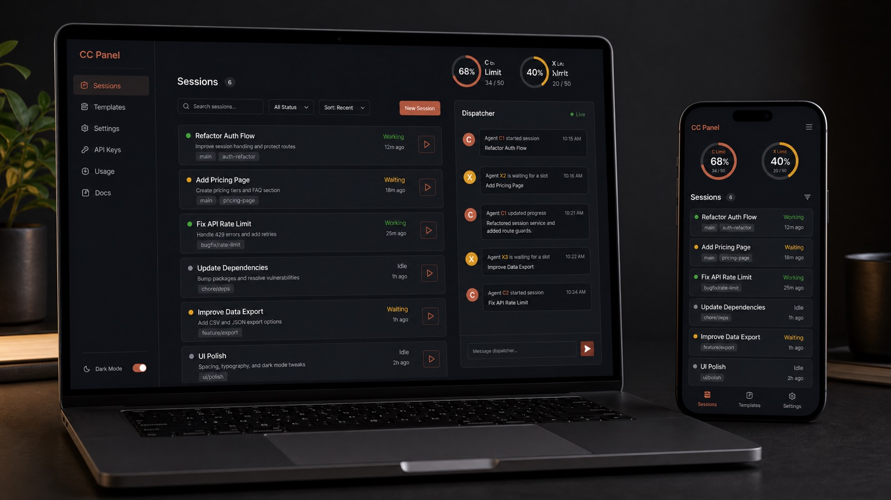
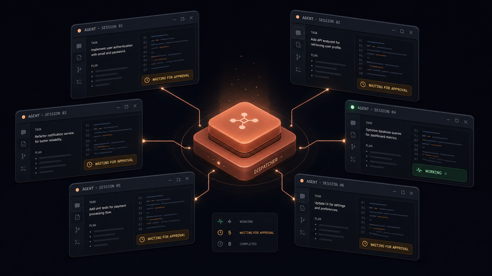
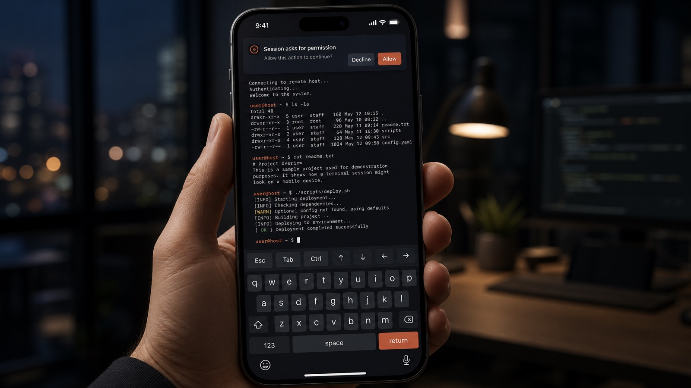
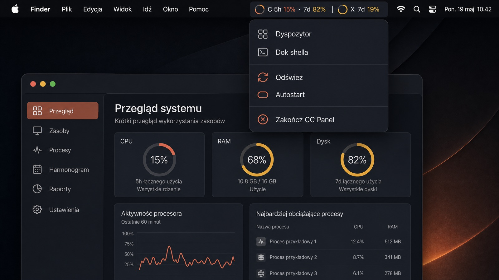
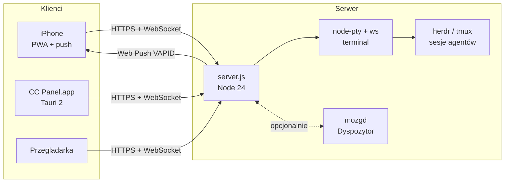

<div align="center">



# CC Panel

**Jeden panel do wszystkich sesji Claude Code i Codex - z telefonu, z Maca, z przeglądarki.**


</div>

---

Agenci AI pracują w tle na serwerze, a Ty jesteś przy biurku, w pociągu albo na kanapie. CC Panel pokazuje, co każdy z nich robi, kto czeka na Twoją decyzję i ile zostało limitu. Jednym dotknięciem wchodzisz w terminal dowolnej sesji, odpowiadasz i wracasz do swoich spraw.

> Projekt powstał na własne potrzeby i jest udostępniony „tak jak jest”. Interfejs jest po polsku.

## Co potrafi

<table>
<tr>
<td width="50%" valign="top">

### 📡 Dyspozytor
Jeden czat zamiast kilkunastu terminali. Dyspozytor zbiera stan wszystkich sesji, streszcza, kto czeka, i daje przyciski **„Przejdź do sesji →"** prosto w wiadomości. Zakładki tematyczne, przeciąganie obrazów z podglądem miniatur.

</td>
<td width="50%"></td>
</tr>
<tr>
<td width="50%"></td>
<td width="50%" valign="top">

### 📱 Terminal w kieszeni
Pełny terminal sesji na iPhonie: pasek klawiszy (Esc, Tab, Ctrl, strzałki), przewijanie palcem, log jako tekst. Powiadomienie push, gdy agent skończy albo **poprosi o zgodę** - z podglądem, o jakie narzędzie i polecenie chodzi.

</td>
</tr>
<tr>
<td width="50%" valign="top">

### 🖥️ CC Panel.app na Macu
Natywna aplikacja (Tauri 2): limity Claude i Codex w pasku menu, skróty **⌘T** terminal, **⌘D** Dyspozytor, **⌘S** sesje, globalne **⌘⇧Space**. Kafelki CHAT otwierają natywne aplikacje Claude i ChatGPT. Klik w Dock przywraca okno.

</td>
<td width="50%"></td>
</tr>
</table>

### I jeszcze

| | |
|---|---|
| 🗂️ **Sesje** | Lista sesji ze statusem (pracuje / czeka / prosi o zgodę / skończył), sortowanie, wyszukiwarka, nowa sesja Claude/Codex/Shell w wybranym katalogu i modelu |
| ⏱️ **Limity** | Pierścienie 5h / 7d dla Claude (C) i Codex (X), prognoza wyczerpania, push przy ≥ 90% |
| 🐚 **Dok shella** | Terminal `tmux` obok Dyspozytora, szerokość zapamiętywana |
| 💬 **CHAT** | Claude i ChatGPT jednym kliknięciem: na iPhonie i Macu w natywnych aplikacjach |
| 📅 **Kalendarz** | Crony i timery agentów na osi czasu |
| 🎨 **Wygląd** | Motywy (ciemny, jasny, kontrast), rozmiar tekstu, gęstość |
| 🔁 **Remote Control** | Przejście do sesji w aplikacji Claude albo do wątku Codexa w ChatGPT |

<sub>Grafiki koncepcyjne wygenerowane przez GPT Image 2, nie są zrzutami ekranu.</sub>

## Architektura



| Warstwa | Technologia |
|---|---|
| Serwer | Node.js 24, `ws`, `node-pty`, `web-push` - bez frameworka |
| Front | Vanilla JS PWA, `xterm.js`, `@event-calendar` |
| Sesje | herdr (menedżer terminali dla agentów) albo tmux |
| Desktop | Tauri 2 (Rust), WKWebView, osobny magazyn danych dla czatów |

## Uruchomienie

**Wymagania:** Linux, Node.js ≥ 24, tmux (albo herdr), sesje Claude Code / Codex na tej samej maszynie.

```bash
npm install
npm test
PUBLIC_URL=https://panel.example.com npm start
```

Serwer słucha na `127.0.0.1:7690` - wystaw go przez reverse proxy z HTTPS albo `tailscale serve`. Nie wystawiaj go bez TLS do internetu: daje terminal na Twojej maszynie.

| Zmienna | Domyślnie | Do czego |
|---|---|---|
| `PORT` / `HOST` | `7690` / `127.0.0.1` | adres serwera HTTP |
| `PUBLIC_URL` | - | adres panelu w linkach z powiadomień |
| `PROJECTS_ROOT` | `~/Projekty` | katalog z projektami (wybór katalogu nowej sesji) |
| `TLS_PORT` / `TLS_DIR` / `TLS_NAME` | `7443` / `~/.config/cc-panel/tls/...` | opcjonalny wbudowany HTTPS (certyfikat Let's Encrypt) |
| `MOZG_SOCKET` | - | gniazdo demona Dyspozytora; bez niego widok Dyspozytora jest offline, reszta działa |

Konfiguracja i sekrety leżą poza repo w `~/.config/cc-panel/`: `token` (logowanie do panelu), `report-token`, `vapid.json` (Web Push), `machines.json` (maszyny zdalne, domyślnie `{}`).

### CC Panel.app (macOS)

Adresy panelu są wpisane w kod - przed buildem podmień `panel.example.com` i `panel.your-tailnet.ts.net` na swoje w `desktop/src-tauri/src/main.rs` (stałe `LAN` i `TAIL`) oraz w `desktop/src-tauri/capabilities/panel.json`.

```bash
./desktop/build-macos.sh
```

Wymaga Xcode CLT, Rust ≥ 1.90 i Node ≥ 20. Pierwszy build trwa 10-25 minut, artefakty lądują w `~/Library/Caches/cc-panel-desktop/`. Aplikacja jest podpisana ad-hoc: pierwsze uruchomienie przez prawy klik → Otwórz.

## Licencja

[MIT](LICENSE)
